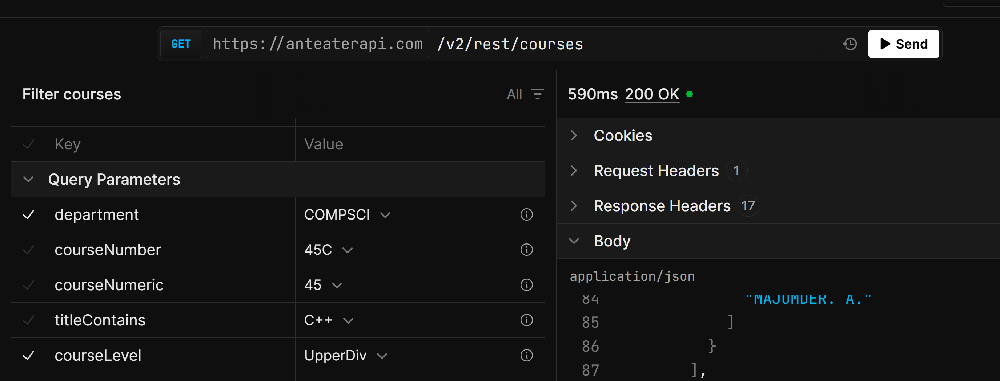
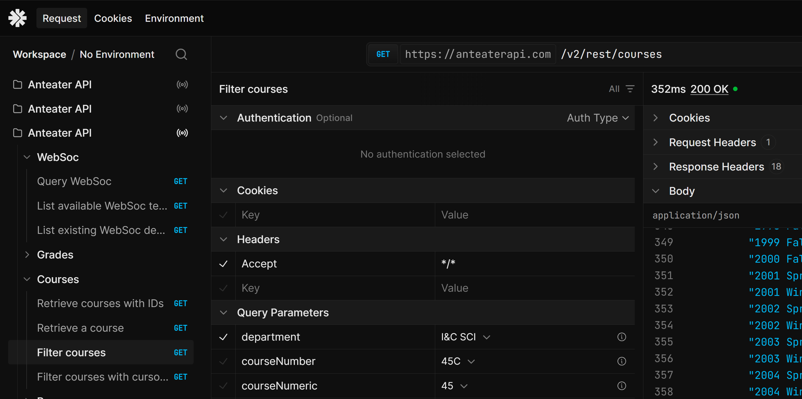

## For COMPSCIWinter26: 
- obtained from this link: https://client.scalar.com/workspace/default/request/ozjSXCjy4oINmUeEM7XpK
- obtained from query: /v2/rest/websoc?department=COMPSCI&year=2026&quarter=Winter
- all COMPSCI courses offered during winter quarter 2026
- removed all courses whose number starts with a 2
- removed all courses specific to honors whose number starts with an H

## For CSUpperDivFullResponse:
- obtained from this query:

- ran this command in terminal to condense the "terms" array formatting: python "c:\Users\alyta\Desktop\Classes\CS 125\cs125\scripts\reformat_arrays.py" "c:\Users\alyta\Desktop\Classes\CS 125\cs125\data\COMPSCIUpperDiv.json" "c:\Users\alyta\Desktop\Classes\CS 125\cs125\data\COMPSCIUpperDiv.reformatted.json"
- removed all courses whose title matches COMPSCI2**, mostly from the dependencies array

## For CSUpperDivStripped:
- took all elements in CSUpperDivFullResponse and ran it through the strip_courses.py script
- only kept relevant fields needed for our mongodb table (id, title, description, prerequisites)

## For ICSCoursesStripped:
- obtained from this query:

- removed all ICS classes that aren't prerequisites for classes in CSUpperDivStripped
- removed all dependencies that don't start with either: COMPSCI1, IN4MATX, I&CSCI
- removed the prerequisiteText field, converting it into a prerequisiteTree to match CSUpperDivStripped format (manual)
- removed COMPSCI145L, where coreq=true
- added the keywords field which should be consistent with what's in Keywords.json

## For Keywords:
- created by Copilot
- assigned ALL upper div CS classes and ALL ICS classes that are prerequisites to keywords
- propagated the "keywords" field into every course in ICSCoursesStripped and CSUpperDivStripped to ensure consistency

## Please place information for each .json in this /data folder here.## For COMPSCIWinter26: 
- obtained from this link: https://client.scalar.com/workspace/default/request/ozjSXCjy4oINmUeEM7XpK
- obtained from query: /v2/rest/websoc?department=COMPSCI&year=2026&quarter=Winter
- all COMPSCI courses offered during winter quarter 2026
- removed all courses whose number starts with a 2
- removed all courses specific to honors whose number starts with an H

## For CSUpperDivFullResponse:
- obtained from this query:

- ran this command in terminal to condense the "terms" array formatting: python "c:\Users\alyta\Desktop\Classes\CS 125\cs125\scripts\reformat_arrays.py" "c:\Users\alyta\Desktop\Classes\CS 125\cs125\data\COMPSCIUpperDiv.json" "c:\Users\alyta\Desktop\Classes\CS 125\cs125\data\COMPSCIUpperDiv.reformatted.json"
- removed all courses whose title matches COMPSCI2**, mostly from the dependencies array

## For CSUpperDivStripped:
- took all elements in CSUpperDivFullResponse and ran it through the strip_courses.py script
- only kept relevant fields needed for our mongodb table (id, title, description, prerequisites)

## For ICSCoursesStripped:
- obtained from this query:

- removed all ICS classes that aren't prerequisites for classes in CSUpperDivStripped
- removed all dependencies that don't start with either: COMPSCI1, IN4MATX, I&CSCI
- removed the prerequisiteText field, converting it into a prerequisiteTree to match CSUpperDivStripped format (manual)
- added the keywords field which should be consistent with what's in Keywords.json

## For Keywords:
- created by Copilot
- assigned ALL upper div CS classes and ALL ICS classes that are prerequisites to keywords
- propagated the "keywords" field into every course in ICSCoursesStripped and CSUpperDivStripped to ensure consistency

## Please place information for each .json in this /data folder here.

## For ICSCOMPSCIReviews.json
- Reviews of all classes (i.e., COMPSCI and ICS)
- ran the script `course_review.py` with no arguments

## For COMPSCIReviews.json
- Reviews of only COMPSCI classes
- ran the script `course_review.py`
    ```
    python course_review --departments COMPSCI
    ```

## For ICSReviews.json
- Reviews of only ICS classes
- ran the script `course_review.py`
    ```
    python course_review --departments ICS
    ```